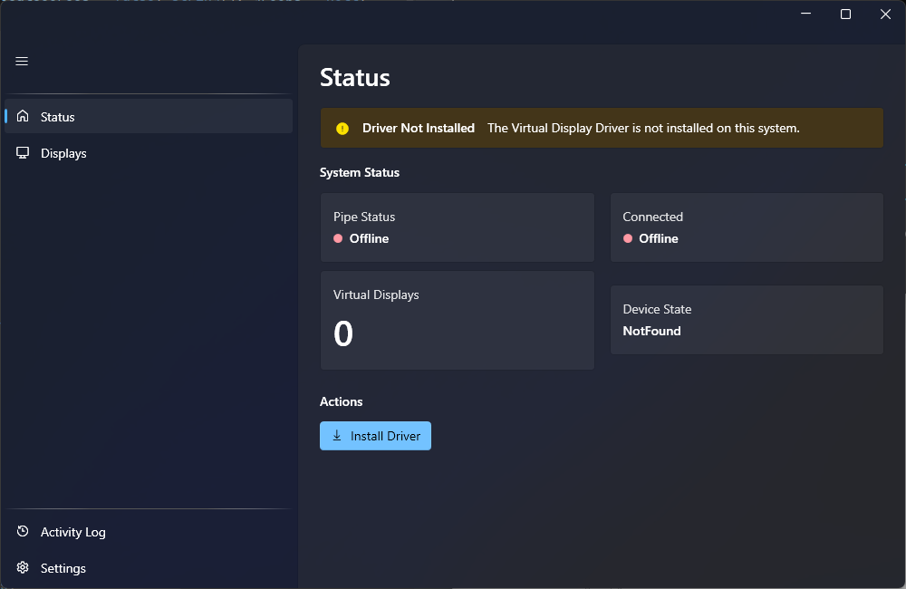

# Virtual Screen Manager

A Windows desktop app for managing virtual display drivers.

## Features

- **Driver Management** — Install, enable, disable, restart, and uninstall the virtual display driver
- **Display Management** — Add up to 16 virtual displays with monitor topology visualization
- **Settings** — Configure HDR+, SDR 10-bit, Custom EDID, hardware cursor, and GPU assignment
- **Auto-Recovery** — Automatically recovers from driver crashes (Code 43)
- **Activity Log** — Timestamped event log with severity filtering

## Download & Install

Download the latest installer from the [Releases](https://github.com/mortenbrudvik/VirtualScreenManager/releases) page.

The installer is self-contained — no .NET runtime or other dependencies required.

## Requirements

- Windows 11 (x64)
